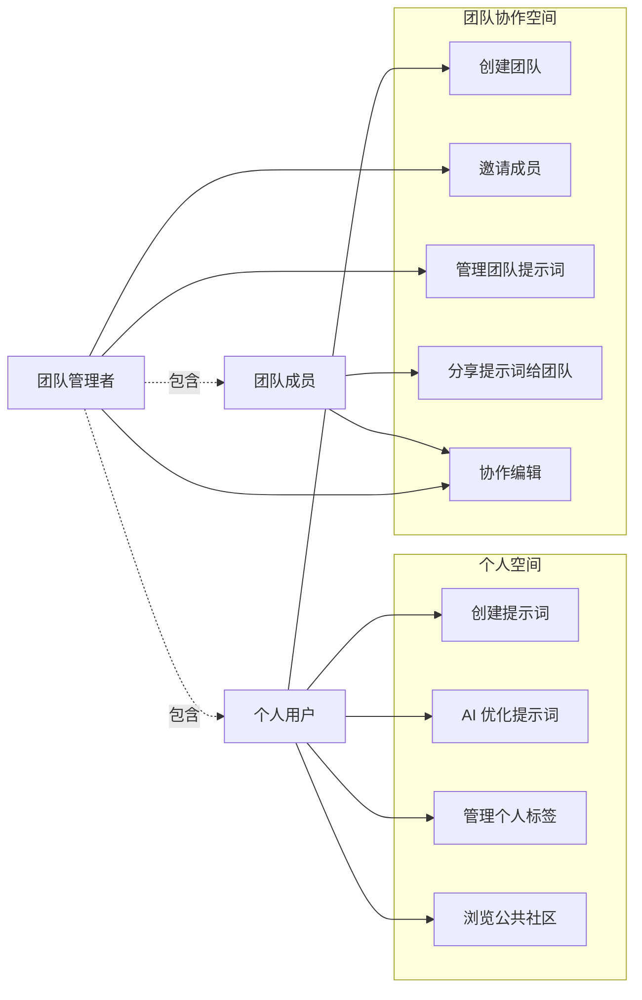
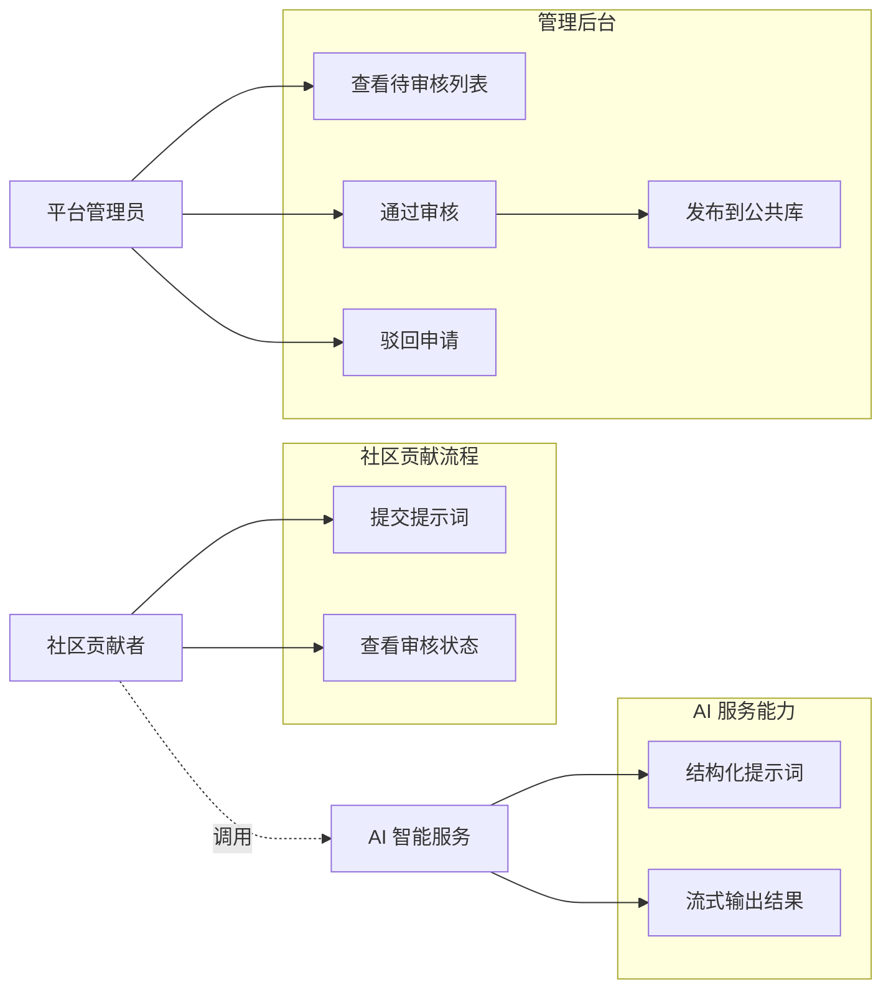

# 01. 角色与用例分析 (Roles & Use Cases)

本文档旨在梳理 PromptMinder 系统的核心用户角色及其主要业务用例。通过可视化的用例图，帮助产品经理快速理解各角色的权限边界与核心诉求。

## 1. 核心角色定义

| 角色名称 | 英文标识 | 描述 | 核心诉求 |
| :--- | :--- | :--- | :--- |
| **个人用户** | Individual User | 注册并登录系统的终端用户 | 管理私有提示词库，使用 AI 优化提示词，浏览社区。 |
| **团队管理者** | Team Admin | 创建并管理团队的用户 | 邀请成员协作，管理团队共享提示词库，维护团队标签。 |
| **社区贡献者** | Contributor | 提交优质提示词到公共库的用户 | 分享提示词，获取社区认可（需审核）。 |
| **平台管理员** | Platform Admin | 系统的运营管理人员 | 审核社区投稿，管理全局配置。 |
| **AI 智能助手** | AI Agent | 集成的 LLM 服务（智谱 AI） | 自动化结构化提示词，提供优化建议。 |

---

## 2. 角色用例视图 (Use Case Diagram)

以下图表展示了各角色在系统中的核心操作权限。

### 2.1 个人与团队协作视角

### 2.2 社区贡献与管理视角

## 3. 关键业务价值点

1.  **团队资产沉淀**：通过 `TeamSpace`，企业的提示词资产不再散落在个人手中，而是统一归档、统一管理。
2.  **AI 赋能提效**：通过 `AIService`，用户无需精通 Prompt Engineering，只需输入简略想法，即可获得结构化的高质量提示词。
3.  **社区生态闭环**：通过 `ContributionFlow` 和 `AdminConsole`，构建“用户生产 -> 平台审核 -> 公共共享”的内容生态闭环。
