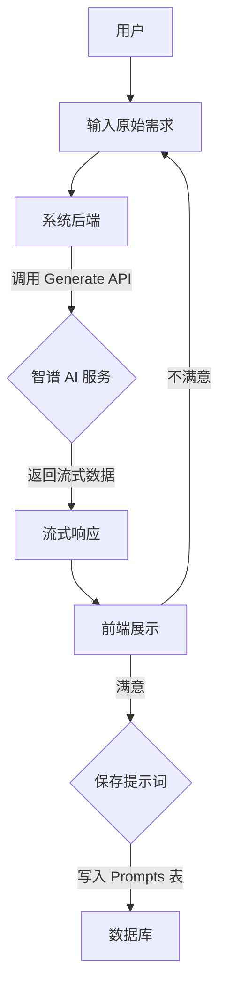
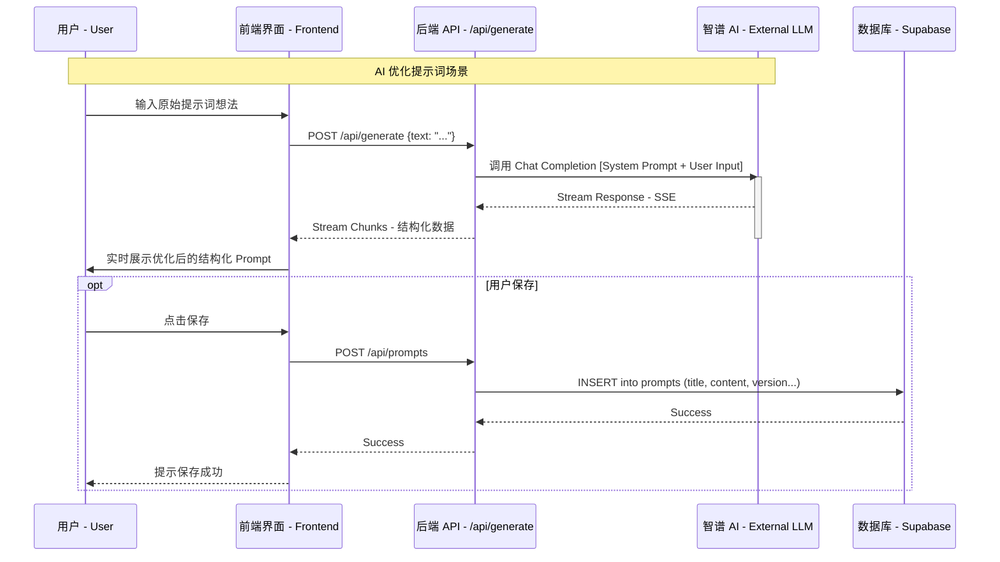
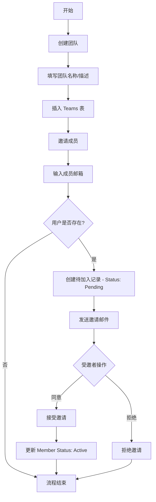
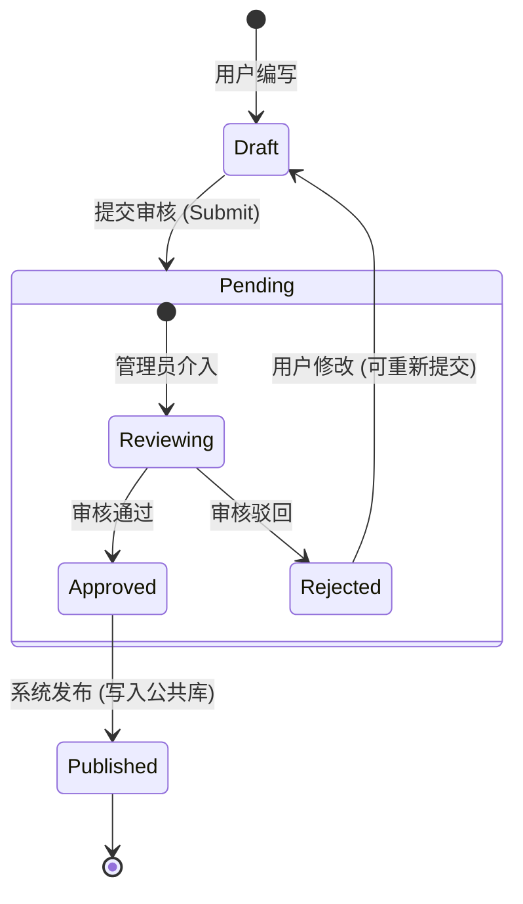
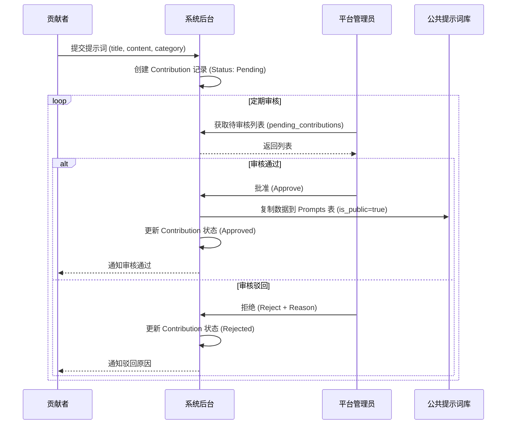

# 02. 核心业务流程 (Core Business Flows)

本文档通过 Mermaid 图表详细展示了 PromptMinder 系统的核心业务路径，包括 AI 提示词生成、团队协作以及社区贡献流程。旨在帮助产品经理理解系统背后的流转逻辑与关键节点。

## 1. AI 智能优化提示词流程

用户输入原始想法，通过调用第三方 LLM（智谱 AI）进行结构化重写，并实时流式返回给用户。

### 1.1 业务流程图 (Flowchart)

### 1.2 时序交互图 (Sequence Diagram)

---

## 2. 团队协作与权限流转

展示用户如何创建团队、邀请成员以及在团队内共享提示词。

### 2.1 团队创建与邀请流程

---

## 3. 社区贡献与审核闭环

展示用户将私有提示词贡献给公共社区的全过程，包含管理员审核环节。

### 3.1 贡献审核状态流转

### 3.2 详细审核交互图

