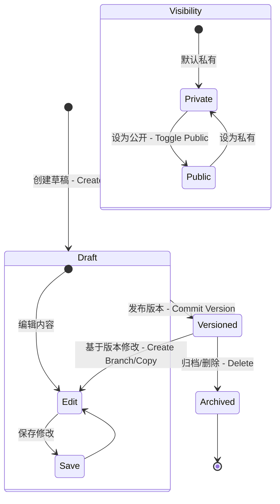
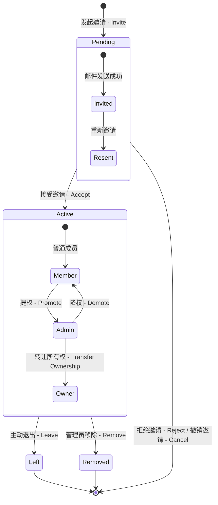
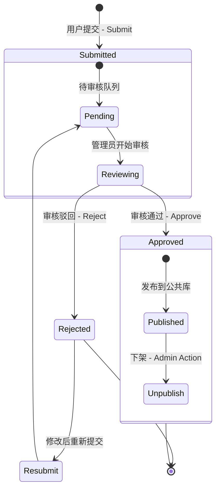

# 03. 数据状态与生命周期 (Data States & Lifecycle)

本文档旨在通过状态机图（State Diagram）详细阐述 PromptMinder 系统中关键实体的数据状态流转。涵盖提示词版本管理、团队成员状态变迁及社区贡献审核机制。

## 1. 提示词 (Prompt) 生命周期

提示词是系统的核心资产，具有版本控制和可见性状态。

### 1.1 提示词版本状态机

**关键说明：**
-   **Draft (草稿)**：用户在编辑器中未保存或未提交版本的状态。
-   **Versioned (已发布版本)**：每一次明确的版本提交都会生成不可变的快照 (`version` 字段)。
-   **Visibility (可见性)**：由 `is_public` 字段控制，独立于版本状态。
    -   `Private`: 仅自己或团队可见。
    -   `Public`: 所有人可见（通常需审核或特定权限）。

---

## 2. 团队成员 (Team Member) 状态流转

团队成员从受邀到加入，再到离开或被移除的全生命周期管理。

### 2.1 成员状态机

**状态字典：**
-   `pending`: 已创建邀请记录，但用户尚未点击确认。
-   `active`: 正式成员，拥有相应角色的权限。
-   `left`: 用户主动退出团队。
-   `removed`: 被团队管理员移出团队。
-   `blocked`: (扩展状态) 被禁止再次加入。

---

## 3. 社区贡献 (Contribution) 审核状态

用户提交到公共社区的提示词，必须经过平台管理员的审核。

### 3.1 审核流程状态机

**字段映射：**
-   对应表：`prompt_contributions`
-   关键字段：`status` (`pending`, `approved`, `rejected`)
-   关联操作：
    -   `approved` -> 触发数据复制到 `prompts` 表，并设置 `is_public = true`。
    -   `rejected` -> 记录 `admin_notes` (驳回原因)，反馈给用户。
