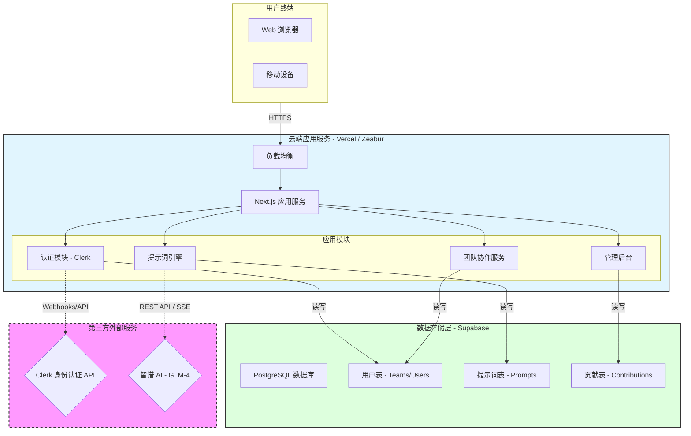

# 04. 系统架构与部署视图 (System Architecture)

本文档通过部署图展示了 PromptMinder 的物理架构与逻辑分层。明确标注了自研模块、第三方集成服务以及数据流向，帮助产品经理理解系统的边界与依赖。

## 1. 总体架构图 (Architecture Diagram)

## 2. 关键集成说明

### 2.1 身份认证 (Clerk)
-   **集成方式**：通过 Clerk SDK 集成在 Next.js 应用中。
-   **职责**：负责用户注册、登录、社交账号绑定（GitHub/Google）。
-   **边界**：用户敏感凭证（密码）托管在 Clerk，不存储在自研数据库中。本地仅存储 `user_id` 映射。

### 2.2 数据库服务 (Supabase)
-   **集成方式**：通过 Supabase Client (PostgREST) 直接连接。
-   **职责**：存储所有业务数据（提示词、团队关系、贡献记录）。
-   **特性**：利用 PostgreSQL 的强大关系能力和 RLS (行级安全策略) 保证数据隔离。

### 2.3 AI 能力 (智谱 AI)
-   **集成方式**：后端 API 代理调用 (`/api/generate`)。
-   **模型**：GLM-4.5-flash。
-   **交互模式**：Server-Sent Events (SSE) 流式传输，提升用户等待体验。

## 3. 部署方案

系统支持一键部署到主流 Serverless 平台。

-   **前端/后端**：Next.js 全栈框架，推荐部署在 **Vercel** 或 **Zeabur**。
-   **数据库**：推荐使用托管的 **Supabase** 实例。
-   **环境变量**：通过 `.env.local` 配置 API 密钥和数据库连接串。
